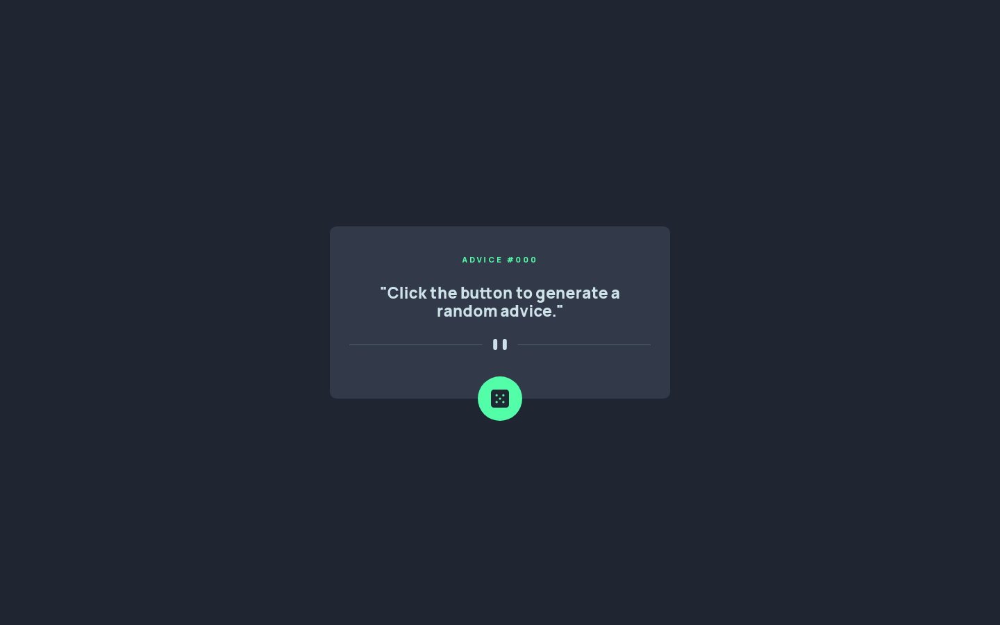

# ADVICE GENERATOR

## Welcome! 👋

This web ui is done using HTML, CSS and JS. In this project you will learn how to use fetch api in Javascript.
API used https://api.adviceslip.com/advice
## Tech Stack

**Client:** HTML, CSS, JS

## Deployment

Deploy this project on Github Pages / Vercel / Netlify.

**Live URL:** https://priyanshusharma0326.github.io/Random-Advice-Generator/
